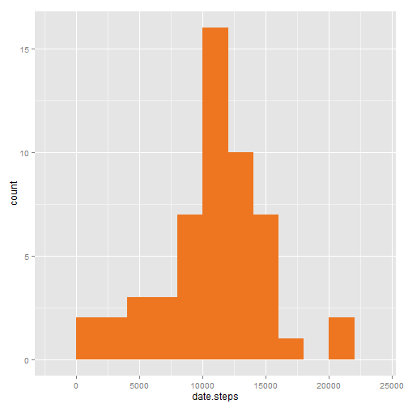

# Activity Analysis

_Author: Pavel Anni_

In this report we present the analysis of activity data collected using smart devices
during two month period. The dataset includes number of steps counted during 5 minute intervals
throughout a day. The variables included in the dataset are:

* __steps__: Number of steps taking in a 5-minute interval (missing values are coded as NA)
* __date__: The date on which the measurement was taken in YYYY-MM-DD format
* __interval__: Identifier for the 5-minute interval in which measurement was taken

In this analysis we answer to following questions:

* What is the mean total number of steps taken per day?
* What is the average daily activity pattern?
* Are there differences in activity patterns between weekdays and weekends?

To perform the first two parts of the analysis we will use the actual data collected from the
devices. To answer the third question we will imput missing values from the average activity
for respective 5-minute intervals.

## Load libraries and data

We start with loading the dataset and the libraies we are going to use.


```r
library(dplyr)
library(ggplot2)

activity <- read.csv("activity.csv")
activity$date <- as.Date(activity$date, "%Y-%m-%d")
```

## What is the mean total number of steps taken per day?

Here we build a data frame that contains total number of steps taken each day during 
the test period (2 months).


```r
total.steps <- activity %>% 
        group_by(date) %>% 
        summarise(date.steps = sum(steps))
```

And now we can build a histogram of total number of steps per day.


```r
a <- ggplot(total.steps, aes(date.steps)) + 
        geom_histogram(fill = "chocolate2", binwidth = 2000)
a
```

 

Mean and median number of steps can be calculated:


```r
mean.steps <- mean(total.steps$date.steps, na.rm = TRUE)
median.steps <- median(total.steps$date.steps, na.rm = TRUE)
```

Mean number of steps per day: 10766

Median number of steps per day: 10765

## What is the average daily activity pattern?

To answer this question we build another data frame with the average number of steps
per 5-minute interval across the whole test period (2 months).


```r
steps.per.int <- activity %>% 
        group_by(interval) %>% 
        summarise(avg = mean(steps, na.rm = TRUE))
```

And now we can build a line chart to illustrate the average daily activity pattern.


```r
b <- ggplot(steps.per.int, aes(interval, avg))
b <- b + geom_area(color = "grey0", fill = "azure2")
b
```

 

On this chart we see a clear maximum of activity. During which interval we observe this
maximum?


```r
max.int <- steps.per.int %>% filter(avg == max(avg, na.rm = TRUE))
```

So this is the interval number 835

## Imputing missing values

To answer the third question we need to imput missing values for the number of steps. 
In the dataset there are several rows with missing data (NA). Here is how many rows
have missing data:


```r
sum(is.na(activity)[,1])
```

```
## [1] 2304
```

Which is about 13 percent of the whole dataset.

For each interval where we don't have data we will insert the average number of steps
during this interval in other days.


```r
# This is the function to replace NA values with averages
na.replace <- function(x) {
        if(is.na(x[1])) { 
            #    Take the average number of steps from steps.per.int data frame
                avg.steps = as.numeric(steps.per.int[steps.per.int$interval == as.integer(x[3]), 2])
            #    and replace NA with it
                x[1] <- as.integer(avg.steps)
            # If not NA, just keep it, but now we have to convert it back to integer
        } else { 
                x[1] <- as.integer(x[1])
                }
}

# Use apply to get a vector with number of steps where NAs are replaced with averages
steps.nona <- apply(activity, 1, na.replace)
# then join it with the original data frame, at the same time removing the old column
# This gives us the new data frame--without NAs this time
activity.nona <- select(cbind(steps.nona, activity), steps.nona, date, interval)
```

Now we can use this data frame to build the same histogram and calculate mean and
median numbers of steps as we did for the original dataset.


```r
# Total number of steps -- now without NAs
total.steps.nona <- activity.nona %>%
        group_by(date) %>%
        summarise(date.steps = sum(steps.nona))
c <- ggplot(total.steps.nona, aes(date.steps)) +
        geom_histogram(fill = "green3", binwidth = 2000)
c
```

 

```r
# Mean and median per day -- now without NAs
mean.steps.nona <- mean(total.steps.nona$date.steps, na.rm = TRUE)
median.steps.nona <- median(total.steps.nona$date.steps, na.rm = TRUE)
```

Mean number of steps per day: 10749

Median number of steps per day: 10641

## Are there differences in activity patterns between weekdays and weekends?

To answer this question we use the new data frame that doesn't have NA values in it.
We create a new factor variable for this data frame indicating if the date is a weekday or 
a weekend.


```r
is.weekend <- function(x) {
        ifelse(weekdays(x) %in% c("Saturday", "Sunday"), "weekend", "weekday")
}

activity.weekdays <- mutate(activity.nona, whatday = is.weekend(date))
activity.weekdays$whatday <- as.factor(activity.weekdays$whatday)
```

Now we group the data frame by interval and by "weekend" factor


```r
steps.nona.per.int <- activity.weekdays %>% 
        group_by(interval, whatday) %>% 
        summarise(avg = mean(steps.nona, na.rm = TRUE))
```

This allows us to build two charts to compare activity patterns on weekdays and weekends.


```r
g <- ggplot(steps.nona.per.int, aes(interval, avg)) 
g <- g + geom_area(color = "grey0", fill = "azure2")
g <- g + facet_grid(whatday ~ .)
g
```

 

We can clearly see that during weekdays the maximum is more prominent. On the other hand, activity 
on weekends is distributed throughout the day more evenly.
